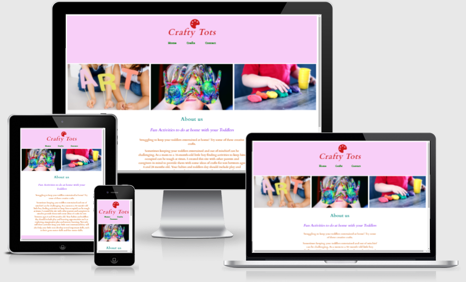
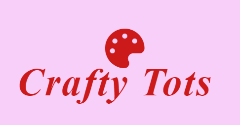
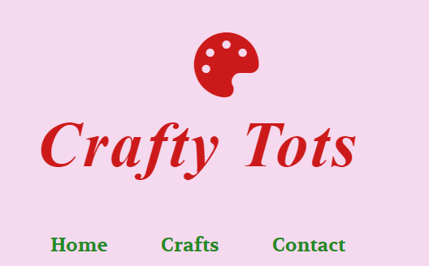
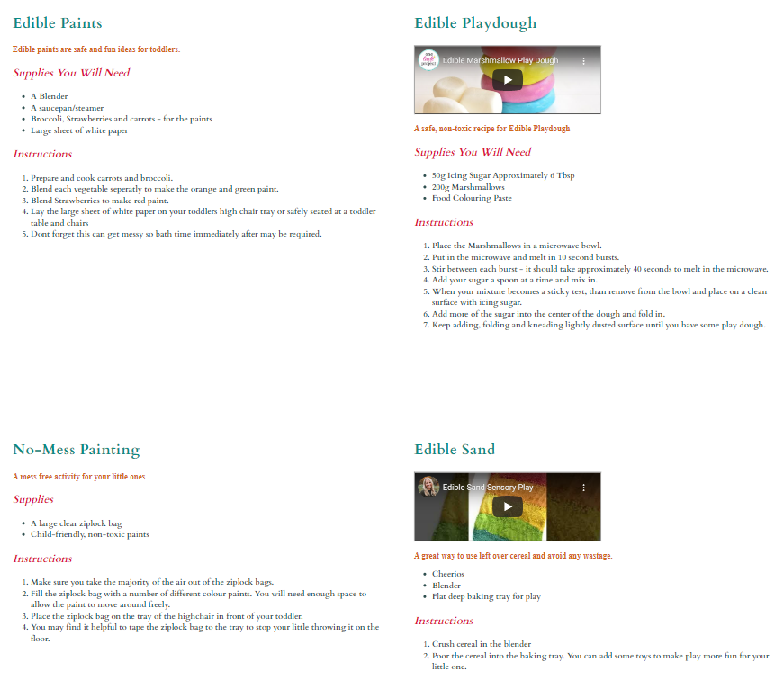
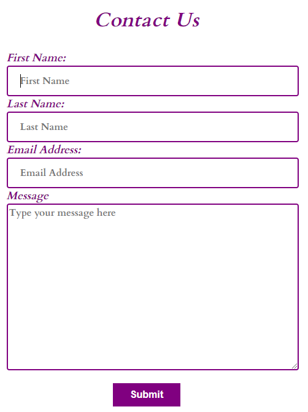
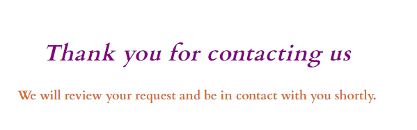
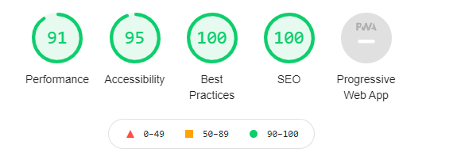

# Crafty Tots

Crafty Tots is a website created to provide parents and caregivers with some fun craft ideas to keep toddlers ages 6 months to 24 months old occupied. These crafts will also help toddlers develop fine motor skills. The Crafty Tots website contains three menu options such as, Home, Crafts and Contact. 

## Features

* Header 

    * The header contains the name of the website Crafty Tots using the color red, 'Cardo' font theme and centered. 
    * A palette symbol has been applied to the top of the header in the color of red and centered. 
    * A background color of light pink has been added to the header of the website. 

    
   

* Navigation

    * Featured at the top of the page underneath the page title, the navigation bar is centered and contains Home, Crafts and Contact. 
    * These tabs link successfully to the other sections on the Crafty Tots website when selected. 
    * The navigation is a forest green color that contrasts well with the header, background colors, images and title of the page. 
    * The navigation clearly identifies the name of the website and makes the different sections of the website easy to locate. 
    * The navigation bar changes to italics and underlined when hovered over. 
    * A background color of light pink has been added to the header of the website which contains the navigation bar. 

* About Us Section

    * The About Us section describes what the use of the Crafty Tots website is for. 
    * The About Us section explains the crafts on the website are for toddlers aged 6 months to 24 months.

* Footer Section 

    * Background color of light pink added to footer. 
    * Facebook, Twitter, Instagram and Youtube social media icons open a seperate browser leading to social media pages when clicked. 
    * Social Media icons given color according to the social media icon color. 

* Crafts 

    * Recipes with Supplies required and Instructions. 
    * Instructional Videos for Edible Playdough and Edible Sand. 
    * When selected the videos take the users to the Youtube to be able to watch the videos in full view. 
    * Images for Edible Paints and No-Mess Painting. 
    * Colors selected contrasts well with the other elements of the website. 

* Contact 

    * Purple Border around input field for first name, last name, email address and message. 
    * Writing in input fields resets when text is typed into boxes.
    * Text automatically added into input fields to indicate which box requires which information. 
    * Text in input boxes is removed once a user starts to type and resets when the information is removed. 
    * Submit button is purple with bold white writing. 
    * When the submit button is hovered over the box is highlighted in a lighter purple and the cursor changes. 
    * Once form is submitted you are than redirected to a thank you page. 

    

* Testing 

    * I have tested this website in different browsers: Chrome, Edge and Firefox.

    * This project is responsiveness, colors contrast well and functions on all standard screen sizes using devtools device toolbar. 

    * Navigation, header, about us, crafts and contact page are all readable and easy to understand. 

    * The contact us form works and includes required fields, will only accept an email address in the email field and the submit button works. 

    * The contact us form redirects the user to a thank you message when the contact form us submitted. 

* Validator Testing 

    * HTML 
        * No errors returned when running code through the official W3C validator. 
    * CSS 
        * No errors returned when running code through the official (Jigsaw) validator.     

* Unfixed Bugs 

    * No unfixed bugs.

* Deployment    

    * The site has been deployed to GitHub pages. The steps to deploy are as shown below: 
        * In the GitHub repository, navigate to the Settings tab. 
        * From the source section scroll to GitHub pages and select to open this section. 
        * Select the Master Branch. 
        * Once the master branch has been selected the link to the deployed site is provided. 

The live link can be located here - [Crafty Tots](https://frankie141.github.io/crafty-tots/)   

## Credits 

* Content

    * The code for the social media links was taken from the CI Love Running Project. 
    * Credit for Youtube videos to ABCDeeLearning and One Little Project.

* Media

    * The images on the Home page were taken from [Pexels](https://www.pexels.com/)
    * Images on the crafts page were taken from [Canva](https://www.canva.com/)

    

