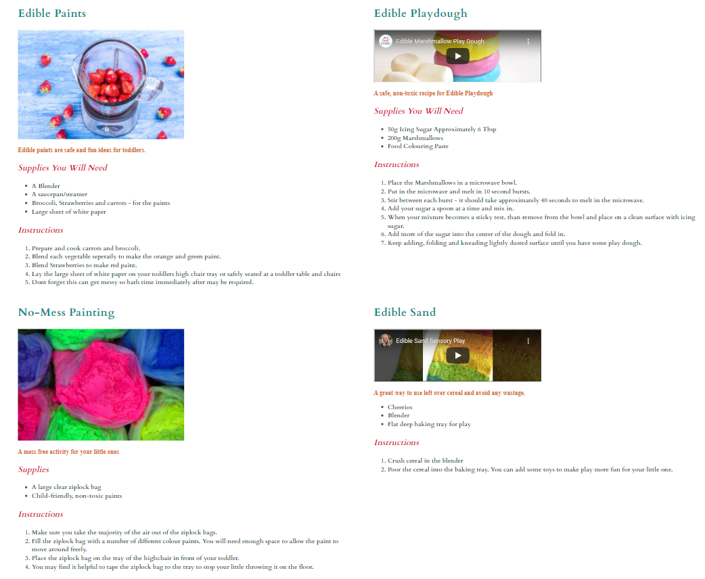

# Crafty Tots

Crafty Tots is a website created to provide parents and caregivers with some fun craft ideas to keep toddlers ages 6 months to 24 months old occupied. These crafts will also help toddlers develop fine motor skills. The Crafty Tots website contains three menu options such as, Home, Crafts and Contact. 

## Home - Features

* Header 
    * The header contains the name of the website Crafty Tots using the color red, 'Cardo' font theme and centered. 
    * A palette symbol has been applied to the top of the header in the color of red and centered. 
    * A background color of light pink has been added to the header of the website. 

    
   

* Navigation
    * Featured at the top of the page underneath the page title, the navigation bar is centered and contains Home, Crafts and Contact. 
    * These tabs link successfully to the other sections on the Crafty Tots website when selected. 
    * The navigation is a forest green color that contrasts well with the header, background colors, images and title of the page. 
    * The navigation clearly identifies the name of the website and makes the different sections of the website easy to locate. 
    * The navigation bar changes to italics and underlined when hovered over. 
    * A background color of light pink has been added to the header of the website which contains the navigation bar. 

* About Us Section
    * The About Us section describes what the use of the Crafty Tots website is for. 
    * The About Us section explains the crafts on the website are for toddlers aged 6 months to 24 months.

* Footer Section 
    * Background color of light pink added to footer. 
    * Facebook, Twitter, Instagram and Youtube social media icons open a seperate browser leading to social media pages when clicked. 
    * Social Media icons given color according to the social media icon color. 

## Crafts - Features

* Crafts 
    * Recipes with Supplies required and Instructions. 
    * Instructional Videos for Edible Playdough and Edible Sand. 
    * Images for Edible Paints and No-Mess Painting. 
    * Colors selected contrasts well with the other elements of the website. 

## Contact Page- Features 

* Contact 
    * Purple Border around input field for first name, last name, email address and message. 
    * Writing in input fields resets when text is typed into boxes.
    * Submit button is purple with write writing. 
    * wWhen the submit button is hovered over the box is highlighted in a lighter purple and the cursor changes. 
    * Once form is submitted you are than redirected to a thank you page. 

    

    

